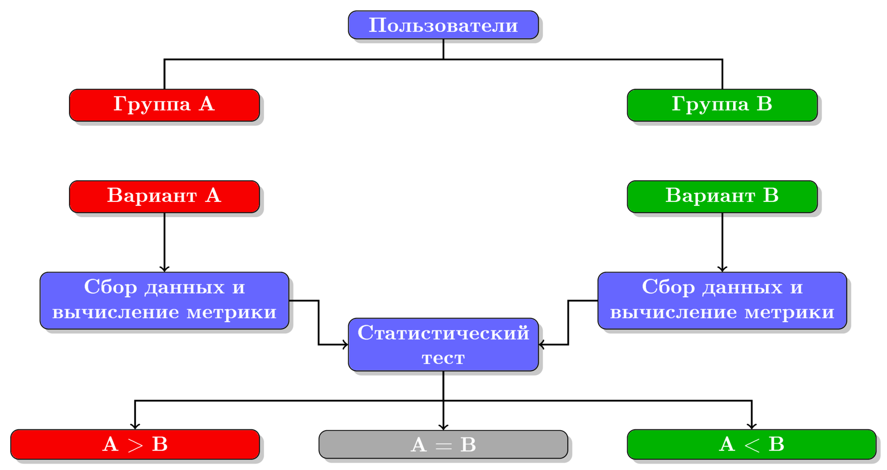

# AB-testing report 
Можно написать про EnabledIds и как реализовано разбитие на группы в продакшене

## Введение

1. Распределение пользователей по двум группам A и B.
2. Представление двум группам пользователей двух различных вариантов.
3. Сбор данных и вычисление значения метрики для каждой группы.
4. Сравнение с помощью статистического теста значений метрики в обеих группах и принятие решения, какой из двух вариантов выиграл.

## Переход к стат тесту, доверительным интервалам и уровню значимости

## Аналитический подход
* Объяснение
* Формулы
* Рассказ о том, что величины не являются независимыми и тд и тп (подробно), переходим к bootstrap

## Bootstrap

## Пример на реальных данных