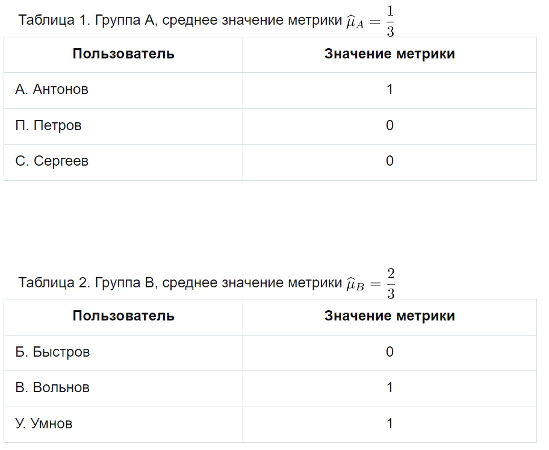
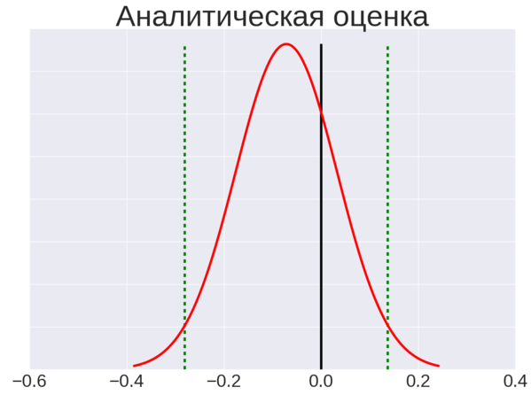
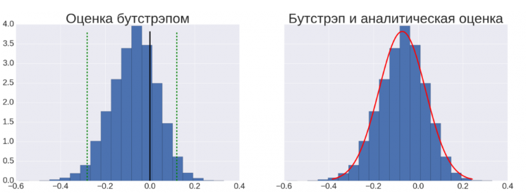
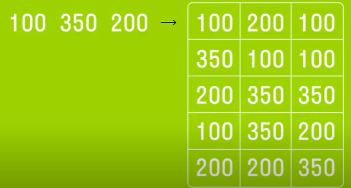
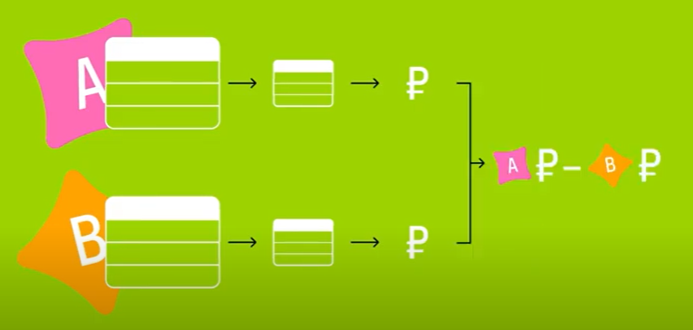
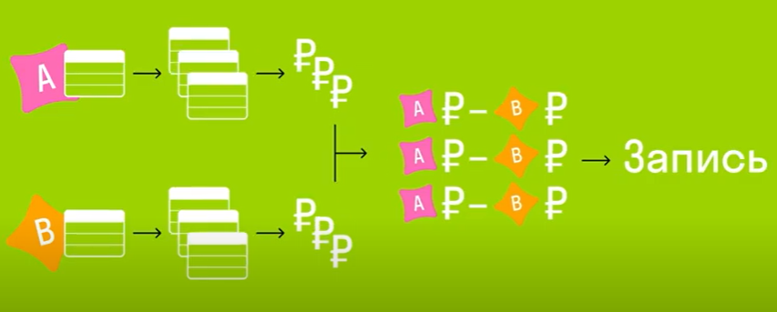
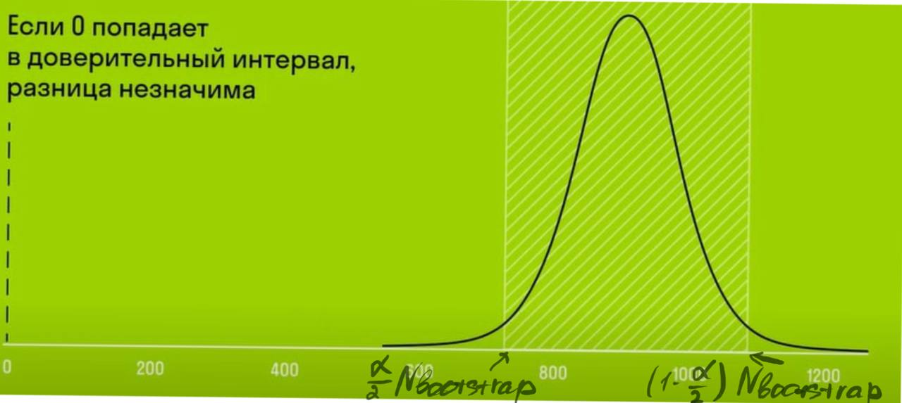

# AB-testing report 
Можно написать про EnabledIds и как реализовано разбитие на группы в продакшене

## Введение

1. Распределение пользователей по двум группам A и B.
2. Представление двум группам пользователей двух различных вариантов.
3. Сбор данных и вычисление значения метрики для каждой группы.
4. Сравнение с помощью статистического теста значений метрики в обеих группах и принятие решения, какой из двух вариантов выиграл.

Пример: группа A - работает в продакшене
группа B - экспериментальный вариант

## Переход к стат тесту, доверительным интервалам и уровню значимости

Среднее значение разности между двумя группами равно: 
$\widehat{\mu}_{\Delta}=\widehat{\mu}_{B} - \widehat{\mu}_{A}= \dfrac{1}{3}$

Всего оценили по 6 значениям, то есть с большой погрешностью.
Поэтому хотелось бы оценить доверительный интервал для  $\mu_{\Delta}$, то есть интервал в котором, «скорее всего», лежит истинное значение.
При вычислении доверительного интервала, используют понятие уровня значимости $\alpha$, который отражает степень нашей уверенности, что истинное значение находится внутри данного доверительного интервала.

Возможное вычисление уровня значимости: 

A/A тест:
* Считаем что действия разных пользователей независимыми
проверка с A/A тестом:
* Измеряли процент прокрасившихся тестов, то есть процент случаев, в которых стат. тест ошибался, утверждая о статистически значимом превосходстве одного варианта над другим
* Измеренный процент ошибок стат. теста сравнивался с заданным теоретическим значением

Если мы много раз будем повторять A/A-тест, то процент случаев, в которых A/A-тест прокрасится, будет примерно равен $\alpha$. То есть в $\alpha \%$ случаев мы отклоняем гипотезу о равенстве вариантов, хотя оба варианта действительно равны (иными словами, в $\alpha \%$ случаев мы совершим ошибку первого рода).

Как определить что тест пройден?
 * Если обе границы доверительного интервала больше 0, значит, выиграл вариант B.
 * Если 0 внутри интервала, значит, ничья — ни один из вариантов не выиграл.
 * Если обе границы меньше 0, значит, выиграл вариант A.

 Например, предположим, что мы как-то смогли узнать, что для уровня значимости $\alpha=5\%$ доверительный интервал для разности в нашем примере равен $\widehat{\mu}_{\Delta} \pm \dfrac{1}{2}\rightarrow \dfrac{1}{3} \pm \dfrac{1}{2}\rightarrow \left[-\dfrac{1}{6}, \dfrac{5}{6}\right]$. То есть, истинное значение разности $\mu_{\Delta}$ скорее всего лежит внутри интервала $\left[-\dfrac{1}{6}, \dfrac{5}{6}\right]$. 
  Ноль принадлежит этому интервалу — значит, у нас нет оснований предполагать, что один из вариантов лучше, чем другой (в действительности один из вариантов может быть лучше, чем другой, у нас просто недостаточно данных, чтобы утверждать об этом с уровнем значимости 5%).

## Аналитический подход

* Объяснение

В аналитическом подходе мы опираемся на утверждение центральной предельной теоремы (ЦПТ) и ожидаем, что разность средних значений метрик в двух группах будет иметь нормальное распределение, с параметрами $\mu_{\Delta}$ и $\sigma_{\Delta}$. 
* Формулы 

    $\widehat{\mu}_{\Delta}$ = $\widehat{\mu}_{B} - \widehat{\mu}_{A}$ 
    
     $\widehat{\sigma}_{\Delta}$ = $\sqrt{\widehat{\sigma}_A^2 + \widehat{\sigma}_B^2} $

Где средние значения ($\widehat{\mu}_A, \widehat{\mu}_B$) и дисперсии средних значений ($\widehat{\sigma}_A, \widehat{\sigma}_B$) вычисляются по стандартным формулам.

Доверительный интервал для нормального распределения:

$(\widehat{x} - \frac{\sigma}{\sqrt{n}} Z_\alpha; \widehat{x} + \frac{\sigma}{\sqrt{n}} Z_\alpha)$,

где $Z_\alpha$ - это квантиль нормального
распределения уровня $1 - \frac{\alpha}{2}$
* Рассказ о том, что величины не являются независимыми и тд и тп (подробно), переходим к bootstrap

Одним из минусов такого подхода является тот факт, что в ЦПТ случайные величины предполагаются независимыми. В реальности это предположение часто нарушается, в частности, из-за того, что действия одного пользователя зависимы. Например, пользователь «Амазона», купивший одну книгу, скорее всего, купит и еще одну. Будет ошибкой считать две покупки одного пользователя независимыми случайными величинами, потому что мы можем в результате получить слишком оптимистичную оценку на доверительный интервал. А это означает, что в реальности процент ложно прокрасившихся A/A-тестов может быть в разы больше, чем заданное значение. Поэтому нужен другой метод оценки доверительных интервалов, например, бутстрэп.

## Bootstrap

Bootstpar — это один из методов непараметрической оценки доверительных интервалов, в котором не делается никаких предположений о независимости случайных величин. 

Как работает bootstrap?

Выбор с помощью бутстрэпа случайных подвыборок значений из групп A и B:

Подсчитать разность средних значений $\widehat{\mu}_{\Delta}$ в этих подвыборках;:

Тыким образом повторять $N_{\textrm{bootstrap}}$ раз:

Упорядочить по возрастанию значения, полученные на каждой итерации. С помощью упорядоченного массива $\left[\widehat{\mu}_{\Delta_1}, \widehat{\mu}_{\Delta_2}, ~ \dots ~ \widehat{\mu}_{\Delta_{N_{\textrm{bootstrap}}}}\right]$ определить доверительный интервал так, чтобы $\sim (1- \alpha)\cdot N_{\textrm{bootstrap}}$ точек лежали внутри интервала. 

То есть, левой границей интервала будет число с индексом
$\dfrac{\alpha}{2} \cdot N_{\textrm{bootstrap}}$, а правой границей — число с индексом $ (1 - \dfrac{\alpha}{2}) \cdot N_{\textrm{bootstrap}}$ в упорядоченном массиве.

## Пример на реальных данных